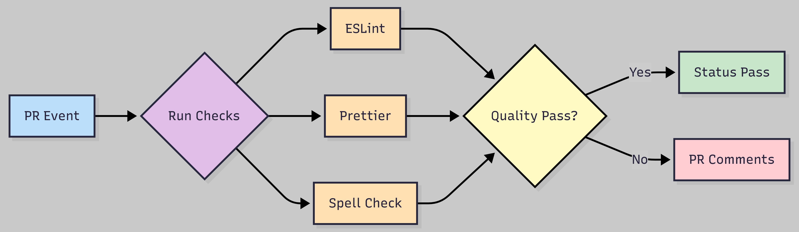
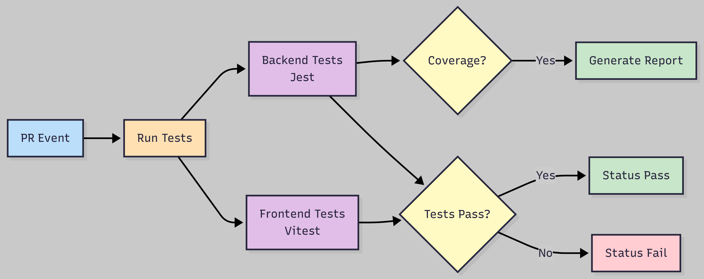
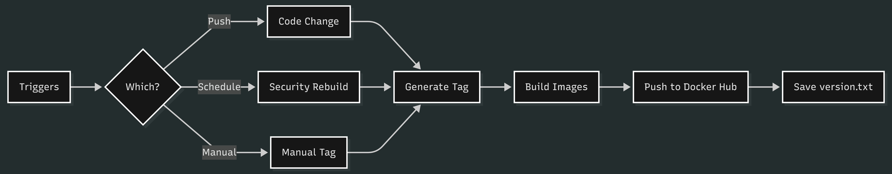
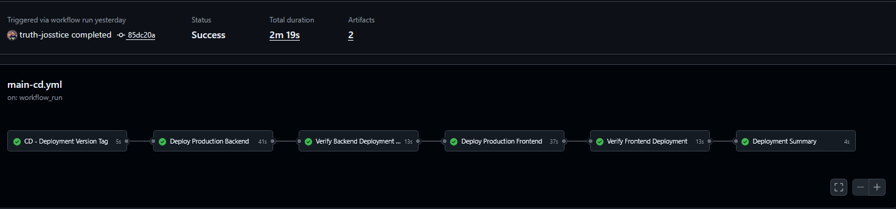

# DEV1004 - Assessment 03: Develop a CI/CD Pipeline

## Table of Contents

- [The Pipeline](#1-the-pipeline-actions-and-workflows)
  - [Custom Actions](#11-custom-actions)
    - [setup-env](#111-setup-env)
    - [test-backend](#112-test-backend)
    - [test-frontend](#113-test-frontend)
    - [build-push-docker-images](#114-build-push-docker-images)
    - [get-version-tag](#115-get-version-tag)
  - [Custom Workflows](#12-custom-workflows)
    - [PR - Code Quality](#121-pr---code-quality)
    - [PR - Test Suites](#122-pr---test-suites)
    - [Main - Build and Push Images](#123-main---build-and-push-images)
    - [CD - Deploy to Production](#124-cd---deploy-to-production)
- [The Tech](#2-the-tech-cicd-systems)
  - [GitHub Actions](#21-github-actions)
  - [Docker](#22-docker)
  - [Docker Hub](#23-docker-hub)
  - [Google Cloud Run](#24-google-cloud-run)
  - [Firebase Hosting](#25-firebase-hosting)
  - [Supporting Infrastructure Services](#26-supporting-infrastructure-services)

## 1. The Pipeline: Actions and Workflows

In developing a CI/CD pipeline, I focused on finding the right tool for the job, and the right tool for my level of development. This meant finding free services, free hosting platforms, and using KISS and DRY principles while developing my workflows.

I created Custom Actions where code would be re-used across workflows, and I used existing actions to keep my workflow files clean. I deployed to two free cloud services, Google Cloud Run for my containerised backend, and Firebase Hosting for my static frontend. I focused on keeping variables secure and injected only when required, ensuring the application deploys easily and consistently while still supporting local development - either via direct local runs, or Docker Compose for a containerized approach.

Here we will discuss the pipeline I created through custom actions and workflows.

---

## 1.1 Custom Actions

### 1.1.1 `setup-env`

- **Action performed:** Sets up the correct Node.js version for a specified directory (`./backend` or `./frontend`), and runs a clean install (`npm ci`) for deterministic builds.
- **Use in workflows:** Any workflow which needs to set up a Node.js environment uses this action, keeping the steps in workflows smaller and more readable. This action is used in `pr-test.yml`, `pr-quality.yml`, and `main-cd.yml`, as all require setting up Node.js environments.
- **Benefits for pipeline:** Abstracts Node.js setup logic into a reusable component, eliminating code duplication across multiple workflow files, and ensuring consistent setup.

### 1.1.2 `test-backend`

- **Action performed:** Uses GitHub Secrets injected as environment variables to execute backend test suites (standard unit tests and integration tests separately). Coverage reports can be optionally triggered by manual workflow dispatch. Preserves all testing reports and uploads as a GitHub Artifact.
- **Use in workflows:** Used in `pr-test.yml` file, a full testing suite workflow for the application. This workflow is a status check which must pass before PRs are merged to the production branch.
- **Benefits for pipeline:** Abstracts the testing logic from the workflow file, and centralises testing to a single workflow. This creates a "all tests must pass" security feature for pushes to production branch along with GitHub Rulesets. Testing action can be re-used for any future workflow additions such as for staging environments as needed.

### 1.1.3 `test-frontend`

- **Action performed:** Runs all existing tests for the frontend application using Vitest, and preserves all test reports uploaded as a GitHub Artifact.
- **Use in workflows:** Used in `pr-test.yml` file, a full testing suite for the application. This workflow is a status check which must pass before PRs are merged to the production branch.
- **Benefits for pipeline:** Abstracts frontend test logic from the workflow file, ensuring consistent execution across the PR workflow. Separates frontend testing concerns while maintaining them as required status checks for production branch protection. Testing action can be re-used for any future workflow additions as above.

### 1.1.4 `build-push-docker-images`

- **Action performed:** Uses GitHub Secrets to inject dynamic variables. Using the `main` branch as a single source of truth, it rebuilds images when changes are made to codebase files. It excludes documentation (.md), as well as `.github/` and `./docs` folder changes that don't require image rebuilds. Applies semantic version tagging to ensure consistency across GitHub releases and Docker images, and supports manual workflow dispatch with optional manual version tagging for flexibility.
- **Use in workflows:** Used in `main-build-push.yml` file. Semantic version tags are generated in the workflow and applied to the action, version tags are uploaded as artifacts to be shared across other workflows in the pipeline.
- **Benefits for pipeline:** Abstracts the Docker image build and push logic from the workflow file, ensuring re-usability across the pipeline, and readability of workflow files. The action is setup for a single project, but adding a "image name" input would make this action mono-repo agnostic and re-usable across multiple similar projects.

### 1.1.5 `get-version-tag`

- **Action performed:** Downloads and parses version tag artifact from `main-build-push.yml` using the `workflow_run` ID, and outputs it for deployment versioning.
- **Use in workflows:** Used in `main-cd.yml` to retrieve and assign the most recent version tags for deployment. Does not overwrite internal version ID, but allows for visual version tracking.
- **Benefits for pipeline:** Ensures consistency of version tagging across container registry (Docker Hub) and deployment platforms, providing clear traceability between builds and deployment.

---

## 1.2 Custom Workflows

### 1.2.1 PR - Code Quality

- **When workflow occurs:** Occurs when any PR to `main` branch is: opened, synchronized, re-opened or marked as ready-for-review.
- **Workflow performs:** Runs ESLint and Prettier checks, using associated config files for reference per directory. Performs a spell-check on all files except expected binary data (.png etc) with inline comments generated for clarity.
- **Placement in pipeline:** Runs in parallel with the `PR - Test Suites` workflow, and is a required status check protecting the `main` branch through GitHub Rulesets.
- **Example diagram:**

_**Figure 1:** PR Code Quality workflow showing ESLint, Prettier and Spell Check stages_

### 1.2.2 PR - Test Suites

- **When workflow occurs:** Occurs when any PR to `main` branch is: opened, synchronized, re-opened or marked as ready-for-review. Can be manually dispatched with an optional coverage tag.
- **Workflow performs:** Executes full test suites on both backend (Jest) and frontend (Vitest) codebases. Backend tests can optionally generate a coverage report when manually dispatched with the `run-coverage` input. All test results are preserved via the `test-backend` and `test-frontend` custom actions.
- **Placement in pipeline:** Runs in parallel with `PR - Code Quality` workflow, and is a required status check protecting the `main` branch through GitHub Rulesets.
- **Example diagram:**

_**Figure 2:** PR Test Suites workflow with parallel backend/frontend test execution_

### 1.2.3 Main - Build and Push Images

- **When workflow occurs:** Triggered on push to `main` branch with explicit exceptions for documentation (.md), `./docs/`, and `./github` folders changes to avoid unnecessary image rebuilds. Can be manually triggered with manual version tag overrides. Scheduled to run once per week (Sunday 2am) for security rebuilds of container base images.
- **Workflow performs:** Uses external action `anothrNick/github-tag-action` to generate semantic version tags. Tags are applied in workflow to GitHub Repo tag and passed to subsequent steps. Uses the `build-push-docker-images` custom action to build and push images to Docker Hub. Saves version tags per workflow as `version.txt` to be accessed by `main-cd` workflow.
- **Placement in pipeline:** Executes after PRs are merged to `main`, must complete successfully before the `main-cd` deployment workflow runs. Ensures Docker Hub images stay consistent with GitHub code and that the most recent version is available for deployment.
- **Example diagram:**

_**Figure 3:** Main branch build workflow showing version tagging and image push to Docker Hub_

### 1.2.4 CD - Deploy to Production

- **When workflow occurs:** Occurs on completed `workflow_run` of `main-build-push` workflow. Exits early if `main-build-push` is not successful.
- **Workflow performs:**
  - **CD - Deployment Version Tag:** Uses `get-version-tag` custom action to download and parse `version.txt` artifact created from `main-build-push` workflow.
  - **Deploy Production Backend:**
    - Installs `gcloud` SDK to communicate with Google Cloud Run via CLI commands.
    - Authenticates to GCP using GitHub Secrets variables injected during workflow.
    - Uses Docker Hub version matching `tag` output from `get-version-tag` custom action to deploy latest backend image, with three retries to protect against transient failures.
    - Outputs Cloud Run revision history in `json` and `txt` formats and uploads as artifacts.
  - **Verify Backend Deployment:**
    - Waits 10 seconds to ensure backend deployment has time to spin up, uses `curl` to send get request to deployed backend URL.
  - **Deploy Production Frontend:**
    - Uses custom action `setup-env` to setup Node.js in frontend environment.
    - Uses Vite to build static `dist` folder for deployment.
    - Installs `firebase-tools` globally to CI environment.
    - Uses Firebase CLI to deploy from `dist` folder.
    - Passes semantic version tag as a deployment message for visual version tracking via the Firebase console
  - **Verify Frontend Deployment:**
    - Waits 10 seconds to ensure frontend deployment has time to spin up, uses `curl` to send request to deployed frontend URL.
  - **Deployment Summary:**
    - Saves deployment version, Cloud Run revision ID, and timestamp of deployment, uploads as artifact for persistent history.
    - Summarises entire workflow as `GITHUB_STEP_SUMMARY`
- **Placement in pipeline:** Final stage of CI/CD pipeline, running automatically after successful testing and code quality checks in PRs, and after successful completion of the `main-build-push` workflow. Deploys verified images to production, completing the delivery cycle from commit to deployment.
- **Example screenshot:**

_**Figure 4:** Successful CD deployment workflow showing backend and frontend deployment and verification stages_

---

## 2. The Tech: CI/CD Systems

### 2.1 GitHub Actions

- **Purpose of technology:** GitHub Actions is the service which executes the entirety of the CI/CD workflows and actions included in this assessment. It provides a runtime environment for every pipeline step, and integrated secret management through GitHub Secrets.
- **Why it was chosen:** GitHub Actions is integrated with GitHub, allowing for expedited development schedules without the need for external services. Workflows can be created and managed in the application repo, and automatically discovered and integrated by GitHub Actions. GitHub Actions marketplace offers free and transparent custom actions for common patterns and requirements for projects. Due to the large use of GitHub for repository management, there is large community support, meaning the learning curve of creating CI/CD pipelines is well supported across all levels. GitHub Actions can be cost prohibitive at enterprise level, but for small or solo programming projects like this one it is perfect.
- **How it's integrated:** GitHub Actions executes all custom actions and workflows defined in the application's `.github` folder. It authenticates with Docker Hub, MongoDB, Google Cloud and Firebase via GitHub Secrets, triggers code quality status checks (`pr-quality.yml`, `pr-test.yml`), triggers build and deployment of code on pushes to the production branch (`main-build-push.yml`, `main-cd.yml`), and orchestrates every step of the CI/CD pipeline from commit to deployment. GitHub Actions automatically detects any workflow files in this application's `./github` folder and provides runtime environments for every pipeline step.
- **Key features used:**
  - **GitHub Hosted runners:** Ubuntu-latest runners provide consistent, managed execution for all workflows.
  - **Workflow automation:** Automatic discovery and execution of YAML files in the `.github/` folder.
  - **Custom triggers:** PR events (opened, synchronised, reopened, ready-for-review), push with paths-ignore, workflow_run dependencies, schedule (cron), and manual workflow_dispatch with inputs.
  - **Status checks:** Required PR checks integrated with GitHub Rulesets for production branch protection.
  - **Artifact management:** Creation, upload and cross-workflow artifact parsing with flexible retention.
  - **Step summaries:** Custom step summary output for deployment visibility and test results.
  - **Secrets management:** GitHub Secrets for secure credential storage and injection across all workflows.
- **Comparison to other technology:**
  - **Jenkins:** Jenkins offers a plugin-based CI/CD automation server with extensive customisation features. It is platform-agnostic, giving developers greater control over hybrid environments without being as closely tied to GitHub. While Jenkins integrates well with GitHub and other version control services for self-hosted and cloud-native setups, it requires more manual configuration. This makes it more appropriate for complicated or legacy systems requiring active management, but adds unnecessary complexity and developer debt for a GitHub native project like this one.
  - **RunsOn:** RunsOn is a newer entry into the CI/CD space, offering a self hosting platform completely through AWS. Cost reductions for large business can be significant, and performance benefits are achievable through the variety of AWS instance types available - allowing each action to run on the most appropriate infrastructure. Operational Expenditure (OpEx) is a key consideration, as RunsOn currently offers no free tiers for small teams. Migration from GitHub actions is straightforward, requiring only a small change to the `runs-on` field with no workflow code changes needed. RunsOn manages Kubernetes, and uses no third parties, meaning codebase is exposed only to the AWS console. This is a strong choice for enterprise or larger developer teams, but a weaker offering when it comes to small or solo projects.

_**Figure 5:** GitHub Actions v Jenkins v RunsOn - key points of difference_

### 2.2 Docker

- **Purpose of technology:** Docker is a widely used industry standard containerisation service, offering simple container customisation and build through `Dockerfile` code, and local multi-containerisation through `docker-compose`. Docker essentially refers to a collection of available services: Docker Desktop, Docker Hub, Docker runtime environments, and Docker Swarm. Docker is used in this application to create portable images of frontend and backend services and provide daemon-based runtime environments for local development. In this pipeline only the backend image is deployed to production, the frontend image is available for deployment if decided in the future, and maintains local development consistency via `docker-compose`.
- **Why it was chosen:** Alternatives are available for every service within Docker, but for junior developers and small projects (especially Single Page Applications like this one), Docker offers a strongly supported collection of services with low developer debt, and a strong representation of native actions through the GitHub Actions marketplace. Docker was chosen for this project to containerise existing application code with simple `Dockerfile` and `docker-compose` files and Docker CLI commands, ensuring local dev environments are ultra portable. I used Docker due to its low learning curve, and simple troubleshooting. It also meant I could keep my platform fragmentation to a minimum and focus on the CI/CD aspects of the assessment.
- **How it's integrated:** Custom actions build images of production application code via defined `Dockerfile` code, either on push to `main` or via manual `workflow_dispatch` triggers (`main-build-push.yml`). These images are version tagged based on trigger type - automatic for push and with optional manual tagging on `workflow_dispatch` - and pushed to the Docker Hub container registry. Local development is made portable through `docker-compose` settings bridging the frontend and backend services, communicating with MongoDB's Cloud Atlas database service.
- **Key features used:**
  - **Dockerfile:** Custom container environment definitions for both backend (Node.js) and frontend (Vite - Nginx) services.
  - **`docker-compose`:** Local bridging orchestration connecting frontend, backend and MongoDB Atlas for portable development.
  - **Docker CLI:** Build, tag, push commands used in workflows.
  - **Layer Caching:** Optimized build times leveraging cached layers during CI/CD builds.
- **Comparison to other technology:** _This section will compare purely based on image build and run features of Docker._
  - **Podman:** Podman offers a service similar to Docker, supporting build, runtime, management and orchestration of container images. It is compatible with `Dockerfile` code, and runs in a daemonless, rootless architecture for improved security and lower resource usage. Podman can be less suited to complex containers and orchestration. A migration to Podman from Docker would be good to explore for simple containers, however I chose Docker due to its existing ecosystem and support, and due to the orchestration requirements of my multi-container application.
  - **Buildah:** Buildah is a specialized container image building tool, operating without requiring a Docker daemon process, making it flexible to CI/CD environments with security constraints. It installs natively on Linux distributions, offering Dockerfile-based builds with granular layer control, and supports rootless execution to reduce attack surface. Despite the security advantages, I chose Docker for this project due to native GitHub Actions integration, tolerance for privileged access in my CI/CD environment, and convenient Docker Hub registry integration.

_**Figure 7:** Docker v Podman v Buildah - key points of difference_

### 2.3 Docker Hub

- **Purpose of technology:** Docker Hub is a cloud-based container registry service that stores and manages Docker images both privately and publicly, enabling version control, sharing and distribution of containerized applications/services. In this pipeline, Docker Hub stores built images and serves as the source that Google Cloud Run pulls from to deploy the production backend. It also houses both service images for portable local dev environments.
- **Why it was chosen:** Docker Hub and Docker are closely tied, offering seamless integration via either CLI commands or the Docker Desktop GUI. Hosting a small number of containers - such as the two needed for this full stack application - is free, with minimal concerns for storage or traffic limits for a project of this size. Dedicated actions on the GitHub Actions marketplace make pushing to the registry simple, and the large community of developers using Docker Hub ensures straightforward troubleshooting. Docker Hub is fit-for-purpose.
- **How it's integrated:** Custom actions push built images to Docker Hub with semantic version tags (`main-build-push.yml`), and the backend service is pulled from Docker Hub during Cloud Run deployment (`main-cd.yml`).
- **Key features used:**
  - **Container storage:** Stores both backend and frontend images in a centralized repository with semantic version tagging.
  - **Image management:** Automatic security scanning and publicly accessible repository settings.
  - **Pull integration:** Cloud Run pulls directly from Docker Hub during deployment.
- **Comparison to other technology:**
  - **GitHub Container Registry (GHCR):** GHCR offers similar image storage and management services to Docker Hub and is tightly integrated with GitHub Actions, with more generous free-tier limits on pulls and image retention. It provides granular access control on a per-image basis, ideal for private internal applications for enterprise level applications. For this assessment, Docker Hub offers appropriately accessible storage for a public application, widespread community adoption and support, lower developer debt for any potential future tech changes, and prevents platform lock-in.
  - **AWS Elastic Container Registry (ECR):** AWS ECR is a secure, privacy focused image storage service operating on AWS infrastructure. It is tightly integrated with other AWS services, and offers granular and robust access control through AWS IAM. AWS offers integrated vulnerability assessments, immutable tags, and flexible lifecycle policies for enhanced security. Its pay-per-use model offers competitive free tiers for public images with predictable usage patterns. As the name suggests, scaling is on-demand and elastic. AWS is a huge ecosystem, with high levels of industry use at the enterprise level. I chose Docker Hub for this project due to its low learning curve and developer-friendly console (developer first design is important when you'll use it widely), reducing developer debt and avoiding complexity for a small open-source project.

_**Figure 8:** Docker Hub v GHCR v AWS ECR - key points of difference_

### 2.4 Google Cloud Run

- **Purpose of technology:** Google Cloud Run is a serverless container deployment service within the Google Cloud ecosystem. It automatically scales based on traffic - scaling to zero when idle - with optional resource limits. Designed for simplicity and speed, it supports any programming language, and minimizes operational overhead.
- **Why it was chosen:** For this application, a simpler cloud service was ideal. With expected traffic and resource requirements for the backend being minimal, Cloud Run eliminated the need for infrastructure management. Its SDKs are straightforward to learn and support custom automated deployment, and native GitHub Actions integrations make authentication simple through IAM credentials. It also offered a complete solution for a containerised frontend and backend service, accommodating any potential future deployment changes. Finally, and a large part of the decision, the Google Cloud console is developer-friendly, reducing developer debt compared to more complex alternatives.
- **How it's integrated:** Cloud Run pulls the backend image (built and version tagged during `main-build-push` workflow) from Docker Hub (`main-cd.yml`), and deploys to a publicly available URL. Sensitive variables are injected via Google Cloud Secrets Manager, with IAM credentials injected through GitHub Secrets. Cloud Run also provides revision history to the workflow, which is uploaded as an artifact for persistent storage.
- **Key features used:**
  - **gcloud SDK:** Simple CLI with customisable flags for flexible deployment.
  - **Automatic scaling:** Scales to zero when idle, with a maximum of three concurrent instances and 256Mi memory per instance for this application, ensuring predictable costs even under unexpected load - well within free tier limits for expected traffic.
  - **Revision history:** Automatically tracks deployment revisions, accessible through Cloud Run console and CLI commands and stored as artifacts.
  - **Serverless execution:** Cloud Run manages infrastructure, patching and runtime environments.
  - **Secrets integration:** Native injection of Google Cloud Secrets Manager via the `--update-secrets` flag, ensuring latest production variables are used and secrets remain dynamic.
  - **HTTPS endpoints:** Automatically provisions managed SSL certificates, and provides a public HTTPS URL.
  - **Concurrent request handling:** Container instances are able to handle multiple simultaneous requests if required.
- **Comparison to other technology:**
  - **AWS EC2:** AWS EC2 is a service within the larger AWS ecosystem that provides manually configured infrastructure for container instances - giving developers control over operating system, network config, security settings and runtime environment. It offers a wide range of instance types optimized for different memory and compute requirements, with dedicated config leading to higher resource efficiency. EC2 provides consistent, long-running deployment for applications expecting constant and predictable traffic. For this project, with an expectation of low resource requirements and traffic, it was unnecessarily complex to configure AWS. The AWS console also introduces developer friction with its steep learning curve. Choosing Cloud Run kept setup simple, with the option to integrate more advanced features with future deployments.
  - **Render:** Render is a simple to use and popular cloud service, with default continuous deployment through direct integration with GitHub Repositories. It has generous free tiers for small teams and solo projects, whilst offering simple customisation of resource management. Render is capable of deployment via containers, and can be integrated with GitHub Actions through native custom actions. Before containerisation this application's backend service was deployed via Render, but the free option spins completely down when idle. I chose Cloud Run for my CI/CD Pipeline because it scales to zero, but spins up in seconds for low resource containers, and also offers more customised setup across the board - giving developers granular resource control, load balancing options, volume mounts where required, and integration with the wider GCP ecosystem.

_**Figure 9:** Google Cloud Run v AWS EC2 v Render - key points of difference_

### 2.5 Firebase Hosting

- **Purpose of technology:** Firebase Hosting is a static web hosting service that deploys frontend applications from build output folders or basic HTML files. It provides global CDN delivery, custom domain support and automatic SSL certification - all with a generous free tier ideal for small teams and solo projects.
- **Why it was chosen:** Firebase is incredibly simple to setup, and its CLI deploys with a simple one line command. For a Single Page Application with no server-side rendering requirements, a simple static hosting service was more appropriate than containerised or complex deployment methods. The expected low traffic and minimal resource needs meant complex or granularly controlled frontend solutions would be complex for the sake of complexity. Firebase's generous free tier and straightforward GitHub Actions integration also aligned with the focus on keeping developer debt low.
- **How it's integrated:** Firebase CLI uses the applications build command `npm run build` to build a static deployment folder, and uses a simple one line command `firebase deploy --only hosting` to publicly deploy the frontend service. It also attaches a message with the semantic version tags created in the `main-build-push` workflow for visual version tracking through its own console, pictured below:

  
_**Figure 10:** Firebase Hosting console showing deployment history with semantic tagging_

- **Key features used:**
  - **Firebase CLI:** Deploys the frontend service with one line of code.
  - **Firebase console deployment history:** Persistently stores previous deployment history for emergency rollback.
  - **HTTPS routing:** Automatically provisions managed SSL certificates, and provides a public HTTPS URL.
- **Comparison to other technology:**
  - **Netlify:** The go-to standard for simple frontend services, Netlify offers a similar platform to Firebase. It is easy to use, free to use for most small projects, and has little to no learning curve from sign-up to deployment. With some experience in Netlify already, I decided to use a different service here to expand my knowledge and skills regarding frontend deployment.
  - **Google Cloud Run:** Google Cloud Run offers containerised frontend service deployment, which was something I considered initially for this project. For a more complicated frontend service, this may be appropriate, but as my frontend containerisation was executed more for local development portability, it was again complex for complexity's sake. While the frontend Docker image is still built and stored in Docker Hub for development consistency and future deployment flexibility, deploying the static files directly to Firebase Hosting proved simpler and more appropriate for production.

_**Figure 11:** Firebase Hosting v Netlify v Google Cloud Run - key points of difference_

### 2.6 Supporting Infrastructure Services

| Service                      | Purpose                                                                      | Integration                                                                   |
| ---------------------------- | ---------------------------------------------------------------------------- | ----------------------------------------------------------------------------- |
| Google Cloud Secrets Manager | Stores production DATABASE_URI and JWT_SECRET_KEY                            | Mounted at runtime via `--update-secrets` flag to most recent secret value    |
| Google Cloud IAM             | Manages service account permissions and authentication                       | Server account key stored in GitHub secrets with minimum required permissions |
| MongoDB Cloud Atlas          | Externally deploys the production database, with minimal management required | DATABASE_URI injected during runtime through GitHub secrets                   |
