# DEV1004 - Assessment 01: Containerization of an Existing Application

## Table of Contents

1. [Application Summary](#application-summary)
2. [System Architecture](#section-1-system-architecture)
3. [Container Internal Design](#section-2-container-internal-design)
4. [Security & Secrets Management](#section-3-security--secrets-management)
5. [CI/CD Pipeline](#section-4-cicd-pipeline)

## Application Summary

A full-stack MERN application containerized with Docker, linked to an external MongoDB cloud atlas Database. Docker Images are hosted on Docker Hub.
_Runs via `docker compose up` with environment variables configured_

For detailed application specific information head to:  

- [Backend Readme](./backend/README.md)
- [Frontend Readme](./frontend/README.md)

___

## Section 1: System Architecture

_**Figure 1:** A high level system architecture view_


### **1.1: Frontend Container**

The frontend container consists of a SPA created with `React`, built with `Vite`, and served with `Nginx`. Nginx serves all of the static html, css, assets from the `./dist/` folder, and uses a proxy for all API requests. Using Nginx as an in-built web server ensures the image size remains manageable, and gives users a more reliable experience when using the container.

Nginx needs to be configured to work with the React SPA. Based on the config below, nginx will serve `index.html` for all non API-routes, enabling navigation without server-side route definitions. I will discuss the proxy settings in section 1.4:

```conf
    # Handle React Router routes explicitly - always serves the index html file allowing navigation
    location / {
        try_files $uri $uri/ /index.html;
    }

    # Proxy ALL API requests to backend explicitly
    # Include all backend routes 
    location ~ ^/(auth|friendships|leaderboard|movies|users|reel-progress) {
      proxy_pass http://backend:3000; # Manually sends requests to backend:3000 (docker container bridge)
      proxy_set_header Host $host; # Ensures the original host is preserved
      proxy_set_header X-Real-IP $remote_addr; # Sends the actual user's IP address to the backend not nginx server IP
      proxy_set_header X-Forwarded-For $proxy_add_x_forwarded_for; # Shows the nginx proxy as a pass through for transparency
      proxy_set_header X-Forwarded-Proto $scheme; # Tells the backend this was either an HTTP or HTTPS request 
    }
```

### **1.2: Backend Container**
<!-- Node.js, Express -->
The backend container uses Express as the application server, with Node.js 22 Alpine providing the runtime. Using Alpine has benefits including: smaller image size, added security and faster deployment.  Express handles the business logic, and communicates with the database. This abstracts the complex logic for greater control, functional design ensuring frontend is skinny, and added security when communicating with MongoDB.

### **1.3: MongoDB Atlas**

The database in this system is external through MongoDB Cloud Atlas. This provides greater security, as well as ensuring a smaller image size. NoSQL databases can have large file sizes (binary for image files), keeping them as external services provides a much more manageable image size.

### **1.4: Docker Compose Network & Nginx Configuration**

Docker compose creates an internal DNS network by connecting two or more images. The frontend container is mapped to port 80, with Nginx acting as both a static web-serve and, a reverse proxy for API requests to `backend:3000`. This proxy configuration avoids CORS issues by explicitly keeping calls within the same origin from the browser's perspective. Docker compose creates a network bridge via Docker's internal DNS (`app-network`) enabling internal service discovery, allowing the exposed port of `backend:3000` to be resolved by the frontend. Use of Docker's bridge network keeps the project fully portable, as it does not rely on hardcoded IP addresses.

_**Figure 2:** Full-stack container architecture showing component relationships_


## Section 2: Container Internal Design

### **2.1: Build Stages:**

The backend container uses a single stage build, as Node.js is required for the runtime. In comparison, the frontend uses multi stage builds, where build dependencies (Node, npm) can be discarded after the build phase whilst Nginx runs a lightweight runtime.

### **2.2: User Security:**

For greater security, the backend container creates a new non-root user group (1001) and adds a "nodejs" user. This helps provide a barrier against access to the host file system, and ensures all privileged actions cannot be exploited from users from within the image.

### **2.3: Health Checks**

Both backend and frontend have in built health checks. This gives immediate feedback to users before using the images themselves, and can provide early troubleshooting feedback.

```Dockerfile
# Backend Health Check

# A basic GET request is sent to the root of the API, responses of 200 are healthy
HEALTHCHECK --interval=30s --timeout=10s --start-period=30s --retries=3 \
  CMD node -e "require('http').get('http://localhost:3000', (r) => r.statusCode === 200 ? process.exit(0) : process.exit(1))"

# Frontend Health Check
# A wget (webGET) request is sent to the base url (localhost:80) set by Nginx. If Nginx is active, frontend is healthy.
HEALTHCHECK --interval=30s --timeout=10s --start-period=30s --retries=3 \
  CMD wget --quiet --tries=1 --spider http://localhost/ || exit 1
```

### **2.4: .dockerignore Optimization**

`.dockerignore` files have been created for both build stages, and follow best practices for security, smaller image size, and future proofing. `node_modules` and `.git` folders are skipped as these often contain large binary files and can result in clashes when running `npm install`. `.env` and other associated sensitive files are skipped ensuring exploitable data is never exposed.

## Section 3: Security & Secrets Management

### **3.1: Application Auth:**

The application uses an internal authentication system as shown below:

_**Figure 3:** A simplified authentication flow with essential steps_


### **3.2: Secure Environment Variables:**

Security relevant environment variables are added during runtime in development and build phases, and through GitHub secrets for CI/CD.

```yaml
jobs:
  # Test code passes all existing tests & build images if passing
  test-and-build:
    runs-on: ubuntu-latest
    env:
      # Sensitive environment variables injected from GitHub Secrets
      DATABASE_URI: ${{ secrets.DATABASE_URI }} 
      JWT_SECRET_KEY: ${{ secrets.JWT_SECRET_KEY }} 
      TOKEN_HEADER_KEY: Authorization
      NODE_ENV: test
```

A simple process flow of where environment variables are injected is below:


### **3.3: Security Benefits**

Benefits of choices made in the build phase are:

- **Smaller Attack Surface:** Alpine builds use less packages and leave less room for exploits due to smaller file sizes.
- **No Hardcoded Secrets:** Secrets are never hardcoded, and are injected either at runtime during dev/testing or from external secure locations during CD.
- **Exploitable Variables Dual Protected:** Local environment variables and production variables are protected by `.dockerignore` and GitHub secrets encryption, ensuring credentials never appear in image layers or source control.
- **Cloud Service Database:** Keeping the database in a cloud service provides MongoDB Atlas' default security settings, and ensures database is not directly accessible to users.

## Section 4: CI/CD Pipeline

This project includes three workflows using GitHub actions for CI/CD.

### **4.1: CI Actions Workflow**

 First is the `test-secrets.yml` workflow which ensures key application variables exist as expected in GitHub Secrets. These are never exposed but confirmed to be the correct or expected length. This occurs on all push actions regardless of branch.

_**Figure 4:** A diagram of the process flow within the `test-secrets.yml` workflow_


Second, a code quality workflow `ci-code-quality.yml` runs on pull requests, checking for linting and spelling errors. Failed linting blocks the workflow, while spelling mistakes generate inline suggestions via `reviewdog`. The main branch requires manual review, preventing automatic merges of problematic code. Further enforcements could be made if necessary.

_**Figure 5:** A diagram of the process flow for the `ci-code-quality.yml` workflow_

```mermaid
flowchart TD
    PR["Pull Request Created/Updated"] --> Trigger["Workflow Triggered<br>code-quality.yml"]
    Trigger --> PathFilter["Path Filter Applied<br>backend/**, frontend/**, .js, .jsx, .json"]
    
    subgraph "Quality Checks"
        BackendSetup["Backend Node.js Setup"]
        BackendLint["Backend ESLint Check"]
        FrontendSetup["Frontend Node.js Setup"]
        FrontendLint["Frontend ESLint Check"]
        SpellCheck["Spell Check<br>reviewdog/action-misspell"]
    end
    
    PathFilter --> BackendSetup --> BackendLint
    PathFilter --> FrontendSetup --> FrontendLint
    BackendLint --> SpellCheck
    FrontendLint --> SpellCheck
    
    SpellCheck --> Results["Quality Results"]
    Results --> PRComments["PR Inline Comments<br>(if spelling errors)"]
    Results --> Status["Workflow Status<br>✅ Pass / ❌ Fail"]
    
    style PR fill:#f0f0f0
    style Trigger fill:#e3f2fd
    style PathFilter fill:#f1f8e9
    style BackendSetup fill:#f3e5f5
    style BackendLint fill:#f3e5f5
    style FrontendSetup fill:#e1f5fe
    style FrontendLint fill:#e1f5fe
    style SpellCheck fill:#fff3e0
    style Results fill:#e8f5e9
    style PRComments fill:#ffebee
    style Status fill:#f1f8e9
```



### **4.2: CD Actions Workflow**

Finally there is a larger integrated workflow with some conditional triggers:

1. Checks out code base
2. Runs test suites on both backend and frontend using GitHub Secrets
3. Builds Docker images with `github.sha`
4. Verifies builds were created successfully
5. Conditional branch:
    - **IF push to main (both direct and through pull_request merges)** continues to following steps
    - **IF not push to main** skips following steps
6. Inject GitHub Secrets and log in to Docker Hub
7. Tags images with `github.sha` and `latest`
8. Pushes images to Docker Hub

Below is an image of the initial CI testing stages:

```mermaid
flowchart TD
    Trigger["Workflow Trigger<br>push/pull_request to main"] --> Checkout["Checkout Code"]

    subgraph "Backend Testing"
        BackendSetup["Backend Setup"] --> BackendTests["Run Tests<br>Unit + Integration"]
    end
    
    subgraph "Frontend Testing"
        FrontendSetup["Frontend Setup"] --> FrontendTests["Run Tests"]
    end
    
    Checkout --> BackendSetup
    Checkout --> FrontendSetup
    
    BackendTests --> Build["Build Docker Images<br>Tagged: backend:$SHA"]
    FrontendTests --> Build
    
    Build --> EndCI["✅ CI Complete"]
    
    style Trigger fill:#f0f0f0
    style BackendSetup fill:#f3e5f5
    style BackendTests fill:#f3e5f5
    style FrontendSetup fill:#e1f5fe
    style FrontendTests fill:#e1f5fe
    style Build fill:#fff3e0
    style EndCI fill:#f1f8e9
```



Below is the proceeding CD stages:


___

## Conclusion

This assessment demonstrates modern containerisation of a full-stack MERN application using Docker, Docker Compose, External Cloud Database Services and GitHub Actions CI/CD. All components are securely configured, sensitive keys and variables are never exposed, and follows user-experience based decision making for smaller image size.
