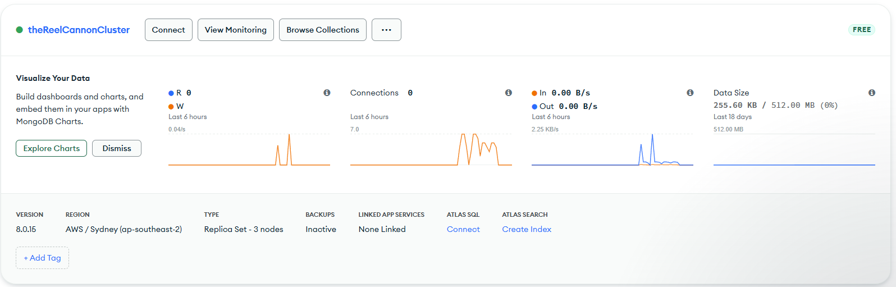
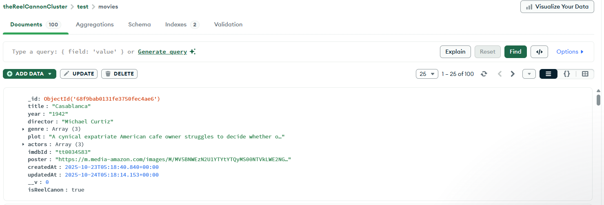

# The Reel Canon Backend API

## Table of Contents

### In This Document

1. [Overview](#1-overview)
2. [Programming Style Guide](#2-programming-style-guide)
3. [Contributing](#3-contributing)
4. [Version Pipeline](#4-version-pipeline)
5. [Database Deployment](#5-database-deployment)
6. [Contributors](#6-contributors)

### Other Documents

1. [Installation & Deployment](/docs/INSTALLATION_AND_DEPLOYMENT.md)
2. [Technologies](/docs/TECHNOLOGIES.md)
3. [Troubleshooting](/docs/TROUBLESHOOTING.md)
4. [Usage](/docs/USAGE.md)

---

## 1. Overview

[The Reel Canon](https://the-reel-canon.onrender.com/) is a backend API built for our MERN project, using mongoDB, Node.js and express. This API provides CRUD functionality to handle data for movies, users and their associated relationships and nested attributes, allowing us to provide data to our front end react project through HTTP requests.

This database uses centralized error handling middleware, authorized routes, JWT token validation and robust validation, to provide a fully functional, RESTful API to store and work with all the database data we need.

Passing 173 tests in 10 test suites, this API has over 90% overall test coverage, and utilizes a mix of unit, end-to-end and integration/route functionality testing.

---

## 2. Programming Style Guide

This project adheres to the [Airbnb JavaScript Style Guide](https://github.com/airbnb/javascript), enforced through ESLint configuration and Prettier formatting to ensure quality and maintainability. This style guide allows our code to be more consistent, readable, predictable and efficient.

Specific settings for the styling can be found in the [prettier configuration file](./prettierrc.json) and the [eslint configuration file](./.eslintrc.cjs). The [eslint-config-airbnb-base](https://www.npmjs.com/package/eslint-config-airbnb-base) was installed as a dev dependency to expedite the style guide setup process.

---

## 3. Contributing

For other devs looking to contribute to the project, please follow the following guidelines:

- **Branching and Forking**: Fork the repository and create feature branches from `main` using descriptive names (`feature/user-auth`, `fix/rating-bug`)
- **Conventional Commits**: Follow conventional commit format (`feat:`, `fix:`, `docs:`, `style:`, `refactor:`, `test:`, `chore:`) for clear commit history
- **Pull Requests**: Pull requests with no explanation will not be merged, please leave detailed comments in your code!
- **Issues**: Issues must be clear and concise, vague issues are non-issues!

---

## 4. Version Pipeline

Below is a list of future plans for improving functionality and features of this project:

**Current Version:**

**V.0.1.0** - Core functionality created and tested

- User authentication/authorisation & profiles
- Reel Canon with 100 movies
- Rating system & progress tracking
- Basic friend system
- Leaderboard

**Examples:**

**The full reel canon** is able to be seeded to the chosen database, and a get route created to send all movie data to the client.

_Figure 1: GET /movies/reel-canon_

**A user seeding script** creates users with reelProgress, ensuring data to manage front end state, and to calculate leaderboard standing are correct and accessible.

_Figure 2: GET /leaderboard_

**Login route for authorisation** has been fully completed, and ensures users with incorrect details or non-existent accounts receive a generic ambiguous message for added account protection.

_Figure 3: POST /auth/login_

**Register route for new users** has been fully completed, with validation for password complexity, pre save password hashing, and query level protection from accidental password exposure.

_Figure 4: POST /auth/register: Token obscured for data security purposes_

---

**Planned Releases:**

**V.0.2.0** - Custom lists

- User-created custom lists
- List sharing between friends
- List subscriptions without friendship
- List comparison features

**V.0.3.0** - Recommendation Engine

- Smart movie suggestions
- Friend-based recommendations
- "Next to watch" features

**V.0.4.0** - Achievements & Advanced Leaderboards

- Genre-specific leaderboards
- Enhanced leaderboards accounting for social features
- Challenge system
  - Trophies based on Genre
  - Base trophy implementation for Reel Canon completion

**V.0.5.0** - Enhanced Social & Notification System

- Movie discussions and user reviews
- Social interactions
- Notifications for friend requests

**V.1.0.0** - Production release

- Real-time notifications
- Production optimization

---

## 7. Database Deployment

**Evidence of deployment of database to Mongo Atlas:**

**Example of seeded movie in deployed Mongo Atlas database:**

---

## 6. Contributors

- **Joss Raine:** [Joss's GitHub Repository](https://github.com/truth-josstice)
- **Nhi Huynh:** [Nhi's Github Repository](https://github.com/lulu-codes)
- **Jordan Leal:** [Jordan's GitHub Repository](https://github.com/jordanleal12)

---
