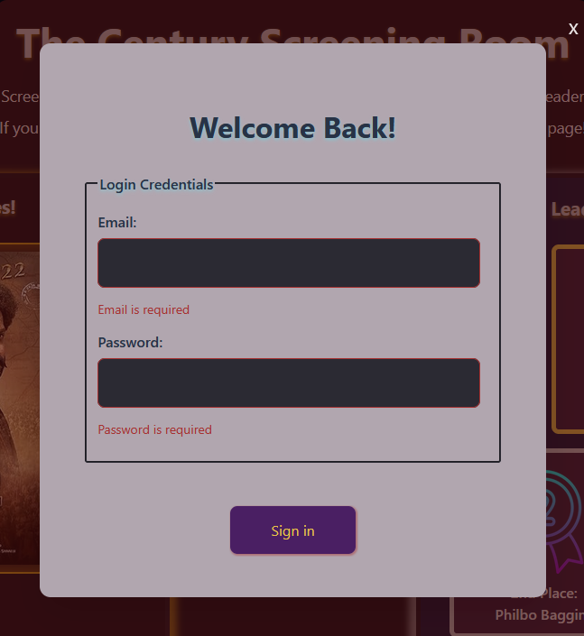
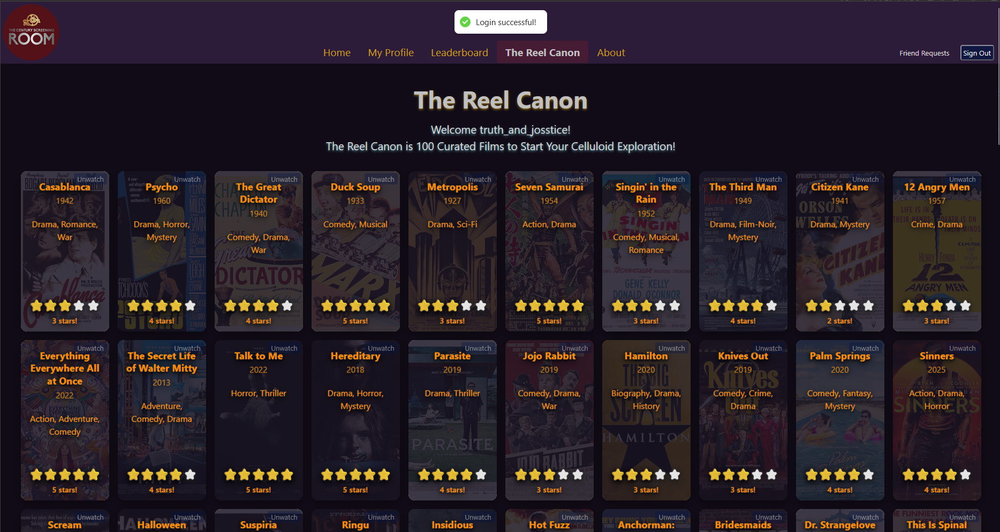
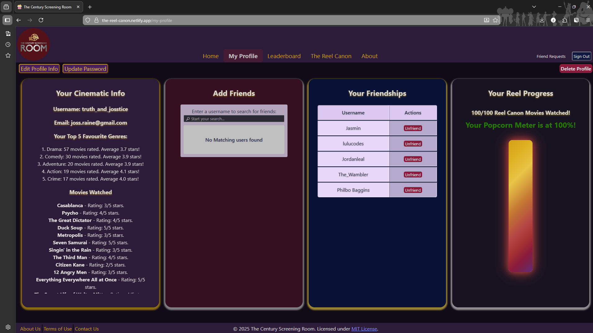
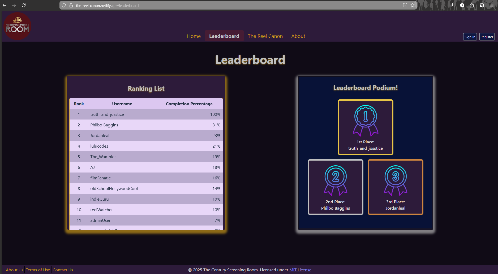
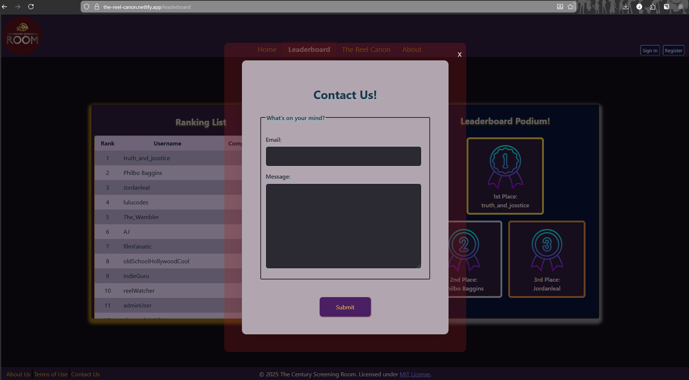

# The Century Screening Room - Front-End App (React)


## Table of Contents

--

## Project Overview

This repository contains the Front-End React application for **The Century Screening Room**. This application was initialised and developed using Vite as the build tool alongside React (Version 19). It serves the client side user interface web application and is designed to work in conjunction with the Back-End API App, and when implemented together they form a fully functional **Full-Stack MERN Application**.

The development of our group's project is documented across the below GitHub repositories for full context:

- [Project Planning, Design and Documentation](https://github.com/CoderAcademy-DEV-MERN-Group/DEV1003-Assessment01)
- [Back-End API Application](https://github.com/CoderAcademy-DEV-MERN-Group/DEV1003-Assessment02)
- [Front-End Application (this repository)](https://github.com/CoderAcademy-DEV-MERN-Group/DEV1003-Assessment03)

### Project Description

**The Century Screening Room** is a social platform web application that showcases the "Reel Canon," a curated list of 100 films for movie enthusiasts to explore, mark and rate movies they have watched.as they complete watching them.

- The app's first release version features the following functionalities:
  - User Authentication and Authorisation
  - Movie Browsing with the "Reel Canon" with 100 loaded movies
  - Rating System
  - "Reel" Progress tracking
  - Basic Friend System
  - Leaderboard
  - Contact Form

Check out this section for further details on the current version features and future development plans [here](#future-development-plans).

---

## Programming Style Guide

This project uses a customised version of the [Airbnb JavaScript Style Guide](https://github.com/airbnb/javascript) enforced through ESLint [`eslint.config.js`](eslint.config.js) and Prettier [`.prettierrc`](.prettierrc) which have been configured to automatically check and format code according to the Airbnb style guide rules. This style guide enables our code to be more consistent, readable, predictable and efficient to support overall quality maintainability and collaboration within our development team.

Using Airbnb's style guide as a base, we made a few notable changes listed below:

| Changes                | Our Choice     | Airbnb        | Purpose of Change                                                                                                                                                                                                                                  |
| ---------------------- | -------------- | ------------- | -------------------------------------------------------------------------------------------------------------------------------------------------------------------------------------------------------------------------------------------------- |
| JSX in `.js`           | Disallowed     | Allowed       | Running with Vite more seamlessly, and more strict definition between components (.jsx) and helper functions (.js)                                                                                                                                 |
| Default exports        | Optional       | Required      | Better for modern React applications which prefer named imports instead of default                                                                                                                                                                 |
| PropTypes              | Off + Not Used | Required      | By using Tanstack Query to share query data across routes, using simple and stable props where applied, and by knowing the exact shape of response data from our Back-End, prop types add noise: safety comes from Backend Schema + Tanstack Query |
| Prop spreading         | Warn           | Error         | Enables React-Hook-Form `register(...)` pattern without boilerplate                                                                                                                                                                                |
| Array destructuring    | Skipped        | Enforced      | Object destructuring more closely aligns with our backend API responses, array destructing was not deemed necessary                                                                                                                                |
| `_unused` vars         | Allowed        | Only for args | Unused event handlers, props or state are safe and more human readable                                                                                                                                                                             |
| a11y interaction rules | Warn           | Error         | Warn is closer to current industry standards for click events. Netflix, Shopify, GitHub use warn or off to avoid false positives                                                                                                                   |
| Prettier               | Integrated     | Not included  | Added to automatically enforce style rules                                                                                                                                                                                                         |

### ESLint & Style Guide Policy

We follow **Airbnb principles** but **optimize for our stack**:

**We DO NOT enforce**:

- `react/prop-types` → Data shape guaranteed by backend + TanStack Query
- `prefer-destructuring` for arrays → No benefit
- `import/prefer-default-export` → Named exports preferred

**We DO enforce**:

- `.jsx` for components only
- Prettier via `eslint-plugin-prettier`
- Prop spreading only with intent (`react-hook-form`)
- Vite HMR rules

---

## Technologies Used

### Hardware Requirements

To run this app, you need:

- **A modern computer:** Laptop or desktop (minimum specs: 4GB RAM, 2GHz CPU)
- **Internet connection:** For packages installation and API access
- **Disk space:** ~500 MB (including dependencies)

---

### Software Requirements

- **Operating System:** Windows, macOS, or Linux
- **Node.js:** Version 18 or higher
- **Package Manager:** npm
- **Runtime Environment:** Node.js runtime environment
- **Code Editor:** VSCode or similar editing software
- **Browser:** Modern web browser (latest versions of Chrome, Firefox, Edge, Safari)
- **Testing:** We use Vitest testing framework during development and run on localhost:3000 via Vite
- **Version Control:** Git (GitHub)

---

### Programming Languages Used

- JavaScript (ES6+)
- JSX
- HTML
- CSS/Sass

---

### Core Dependencies

### `react`

- **Industry Relevance:**
  - React has a built-in large ecosystem providing plenty of built-in packages including for features such as for routing and forms and is a widely used front-end library used for building user interface (UI) components, use hooks, manage state and virtual document-object model (DOM).
  - It also provides flexibility to integrate with other packages and is backed by strong community support.
  - On the [2024 survey ran by Devographics](https://2024.stateofjs.com/en-US/libraries/front-end-frameworks/), the responses reflect that it is the most used front-end framework, therefore making it considered a highly relevant industry skill for developers to learn for front-end development (2025, Devographics).
    

- **Purpose & Usage:**
  - React is a lightweight and the currently the main library
  - Everything is a component under `/components/`. We use functional components with core logic, custom hooks as well as (`useState`, `useEffect`) and for rendering JSX.

- **Why it’s important:**
  - Everything in our app runs on React.

- **Comparisons:**
  - **Vue:** Vue is another popular front-end framework that has a gentler learning curve and is known for its simplicity and flexibility, with its single-file components and also built-in router and states. However, in comparison to React, it offers a component-based architecture and an extensive ecosystem making it more suitable for developers working towards building a larger-scale application.

  - **Angular:** Angular is a comprehensive front-end framework that is considered more robust and suitable for large enterprise applications. It includes a full framework that is out of the box with built-in features like dependency injection and has a steeper learning curve compared to React. For the project scope and size of our team, React's flexibility such as being able to choose our own libraries for routing and state management, makes it more of an adaptable option for us to learn and use while we work in agile to make adjustments to our projects needs.

- **License:** MIT License

---

### `vite`

- **Industry Relevance:**
  - Vite is a production bundler and it is an increasingly popular build tool for modern front-end web development due to its speed and efficiency. It is widely adopted in the industry for its leading performance and ability to provide instant dev server startup for a faster development experience. It is used by large leading companies such as Google, Apple and Microsoft.

- **Purpose & Usage:**
  - Vite is used as the build tool and development server for our React application. It provides a fast and efficient development environment with features like hot module replacement (HMR) for efficiency during development as it updates code in the browser almost instantly.

- **Why it’s important:**
  - It is optimised for modern JavaScript and leverages native ES modules in the browser during development and eliminates bundling delays therefore resulting in faster build times and improved performance compared to traditional bundlers.
  - It is configured with `@vitejs/plugin-react` for React Fast Refresh support.
  - It works with minimal configuration required for most React apps.

- **Comparisons:**
  - **Webpack:** Webpack is also a widely used module bundler that offers extensive configuration options and an extensive plugin ecosystem, which makes it a good option suited for complex enterprise applications. However, it requires a lot of configuration and can be slower during development build time due to its bundling process. Vite, in comparison provides a much more suitable option for our project build because of its faster development experience with instant server start times and also minimal configuration setup required, therefore making it a more ideal and efficient option for our React application.

  - **Create React App:** Create React App (CRA) is another popular tool for bootstrapping React applications with a zero configuration setup. However, CRA can be slower during development due to its bundling process and lacks some of the advanced features that Vite offers, such as faster hot module replacement (HMR) and faster build times. With Vite's modern architecture and optimal performance with development, this makes it more of a preferred choice based on efficiency importance.

- **License:** MIT License

---

### `axios`

- **Industry Relevance:**
  - Axios is a widely used HTTP client library in the JavaScript ecosystem, and is used by almost every major tech company and is considered the go to standard for HTTP requests. It is well known for its simplicity and ease to use when making API requests, which is why it is a popular option for developers especially when handling asynchronous data fetching. It is commonly used particularly in React applications for its promise-based syntax and built-in features that simplify the process of making HTTP requests. It is a reliable and widely supported by the community with extensive documentation making it a well resourced option for developers to use.

- **Purpose & Usage:**
  - It is a promise-based HTTP client for making API requests and centrally configured in `apiServices.js`.
  - It is configured to use base URL for `GET`, `POST`, `PUT`, `DELETE` to interact with the Back-End API, automatic JSON parsing, used for authentication with JWT interceptors (like cancelling tokens), request timeout handling for requests, and used with responses for global error handling with response interceptors.

- **Why it’s important:**
  - Provides developers with working with easier syntax for fetch() and features built-in JSON parsing.
  - It provides us with the core requirements as listed above for our application functionality and is easy to use.

- **Comparisons:**
  - **Fetch API:** The native Fetch API is built into modern browsers and provides a simple way to make HTTP requests. However, it lacks some features that Axios provides out of the box, such as automatic JSON parsing, built in timeout, request cancellation, and interceptors for handling requests and responses. Overall, Fetch API is more suited to a more light application compared to this project and Axios offers far better authentication, interceptors and error handling capabilities compared to the Fetch API.
  - **Ky:** Ky is a lightweight HTTP client based on the Fetch API that offers a simpler API and smaller bundle size and offers some similar features to Axios, but not as extensive and reliable as Axios in comparison.

- **License:** MIT License

---

### `@tanstack/react-query`

- **Industry Relevance:**
  - Tanstack React Query is the most widely used React data fetching library and is used by large production applications such as Netflix, Amazon and Microsoft. It is considered as a highly relevant library in the React ecosystem and is considered the best practice for handling server state in Modern React applications.

- **Purpose & Usage:**
  - Used for managing server state, caching, data fetching and invalidating server data in React applications.
  - It is used in conjunction with Axios (HTTP client) to handle data fetching, for state management and global cache config (queryClient).
  - Every API call goes through custom hooks like `useLeaderboard()` and it handles API data fetching, caching, and background refetching.

- **Why it’s important:**
  - It simplifies async calls and automatically handles loading, error and success states and requires minimal code.
  - Industry relevance as mentioned above.

- **Comparisons:**
  - **Manual useEffect + fetch:** The manual `useEffect + fetch` implementations require more boilerplate code and Tanstack in comparison automatically handles the loading, error and success states, which is built-in and requires minimal code.
  - **Redux Toolkit Query:** Redux Toolkit Query is another popular library for managing server state in React applications, generally would be more ideal if using Redux for client state management. However, Tanstack React Query is more lightweight and has a simpler learning curve to use and is less complex as it works with standard async function. Whereas, with Redux, it requires understanding Redux concepts which can make it more complex and therefore based on our understanding and experience with async functions, we chose to go with Tanstack React Query.

- **License:** MIT License

---

### `react-modal`

- **Industry Relevance:**
  - React-modal is one of the most established modal libraries in the React ecosystem known for its accessibility features and ease of use. It has been used and tested in production for many years and is trusted by major companies for its accessibility-compliant modal implementations.
  - It's focus on accessibility is increasingly important for legal compliance (ADA, Section 508, WCAG standards), making React Modal's built-in accessibility features valuable for inclusive design.

- **Purpose & Usage:**
  - It offers a comprehensive, accessible modal dialog component handling focus management, keyboard navigation and many more accessibility features.
  - Provides portal rendering to avoid z-index conflicts and CSS styling issues
  - Powers all modal dialogues in the application including Login, Registration, Contact Us (form), Terms of Use, and About Us modals, friendship requests (see `/components/modals/`)
  - Centralised styling in `Modals.module.scss` with shared accessibility behaviours

- **Why it’s important:**
  - It makes building accessible modals straightforward as it handles all accessibility requirements following WAI-ARIA guidelines.
  - Is is a modal solution with a consistent UX and helps to ensure it is usable for people with disabilities.

- **Comparisons:**
  - **Custom modal with HTML `<dialog>` element:** The modern HTML `<dialog>` element provides native modal functionality with built-in backdrop and ESC key handling. It's lightweight (zero dependencies) and has good browser support (95%+). However, it requires polyfills for older browsers, offers less styling flexibility, and has limited features compared to React Modal. React Modal provides consistent behaviour across all browsers, advanced features like custom animations and nested modals, and better integration with React's component lifecycle. For a production application targeting diverse users, React Modal's reliability and feature set outweigh the bundle size cost.

  - **Radix UI Dialog:** Radix UI provides unstyled, accessible primitives with more granular control over modal behaviour and better composition patterns. It's more modern with excellent TypeScript support and smaller bundle size. However, it requires more setup code and styling effort—you must build the complete modal structure yourself. React Modal provides a complete, styled solution out of the box with sensible defaults. For this project's timeline and team size, React Modal's batteries-included approach allows faster development while still meeting accessibility requirements. Radix would be better for design-system-first applications with dedicated UI teams.

- **License:** MIT License

---

## Full Technology & Package Reference

All technologies and packages are documented below with **industry relevance**, **purpose**, **alternatives**, and **license**. See [Third-party Licenses](#third-party-licenses) for versioned list.

| Technology / Package         | Purpose                                                          | Industry Relevance                                        | Alternatives                           |
| ---------------------------- | ---------------------------------------------------------------- | --------------------------------------------------------- | -------------------------------------- |
| **JavaScript (ES6+)**        | Core language                                                    | Universal web standard                                    | TypeScript (static typing)             |
| **JSX**                      | Syntax extension for React                                       | De facto in React ecosystem                               | Template literals (rare)               |
| **HTML / CSS / Sass**        | Structure & styling                                              | Sass: 2.1M weekly downloads (npm, Nov 2025)               | Tailwind, CSS-in-JS                    |
| **`react-dom`**              | Renders React to DOM                                             | Required for all React web apps                           | None (core)                            |
| **`react-router-dom`**       | Client-side routing                                              | 12M weekly downloads; standard in SPAs                    | Next.js App Router, TanStack Router    |
| **`react-hook-form`**        | Uncontrolled form state & validation - used for register page    | 8.7M downloads; performance leader                        | Formik (heavier), Zod + useForm        |
| **`clsx`**                   | Conditional className logic - used sparingly for readable code   | 15M+ downloads; tiny (1KB)                                | classnames, template literals          |
| **`framer-motion`**          | Declarative animations - used across UI features                 | Used in 40% of motion-heavy React apps (State of JS 2024) | React Spring, GSAP                     |
| **`react-hot-toast`**        | Toast notifications - used for selected success and error states | 6M+ downloads; zero-config                                | react-toastify                         |
| **`react-error-boundary`**   | Error fallbacks - used across all routes                         | Standard for production error UX                          | Custom try/catch in components         |
| **`react-burger-menu`**      | Mobile nav drawer - used in tablet and mobile breakpoints        | Niche but accessible                                      | Custom drawer, Headless UI             |
| **`@formspree/react`**       | Serverless form backend - used for our contact us form           | 1.2M downloads; no backend needed                         | EmailJS, custom API                    |
| **`vitest`**                 | Unit testing                                                     | 1.8M weekly downloads; 3× faster than Jest in Vite        | Jest (enterprise), Mocha               |
| **`@testing-library/react`** | Component testing                                                | 22M downloads; testing best practice                      | Enzyme (legacy)                        |
| **`eslint` + `prettier`**    | Linting & formatting                                             | Enforced in 80%+ of JS codebases (State of JS)            | Biome, standardlint                    |
| **`@vitejs/plugin-react`**   | React Fast Refresh in Vite                                       | Enables HMR                                               | Create React App (deprecated), Webpack |

---

### Third-party Licenses

The project uses the following open-source packages with their versions and licenses:

| Package Version                         | License           |
| --------------------------------------- | ----------------- |
| @eslint/js 9.36.0                       | MIT               |
| @formspree/react 3.0.0                  | MIT               |
| @fortawesome/free-solid-svg-icons 7.1.0 | CC-BY-4.0 AND MIT |
| @fortawesome/react-fontawesome 3.1.0    | MIT               |
| @tanstack/react-query 5.90.6            | MIT               |
| @testing-library/jest-dom 6.9.1         | MIT               |
| @testing-library/react 16.3.0           | MIT               |
| @vitejs/plugin-react 5.1.0              | MIT               |
| @vitest/ui 4.0.8                        | MIT               |
| axios 1.13.1                            | MIT               |
| clsx 2.1.1                              | MIT               |
| eslint 9.36.0                           | MIT               |
| eslint-config-prettier 10.1.8           | MIT               |
| eslint-import-resolver-node 0.3.9       | MIT               |
| eslint-plugin-import 2.32.0             | MIT               |
| eslint-plugin-jsx-a11y 6.10.2           | MIT               |
| eslint-plugin-prettier 5.5.4            | MIT               |
| eslint-plugin-react 7.37.5              | MIT               |
| eslint-plugin-react-hooks 5.2.0         | MIT               |
| eslint-plugin-react-refresh 0.4.22      | MIT               |
| framer-motion 12.23.24                  | MIT               |
| globals 16.4.0                          | MIT               |
| jsdom 27.1.0                            | MIT               |
| prettier 3.6.2                          | MIT               |
| react 19.1.1                            | MIT               |
| react-burger-menu 3.1.0                 | MIT               |
| react-dom 19.1.1                        | MIT               |
| react-error-boundary 6.0.0              | MIT               |
| react-hook-form 7.66.0                  | MIT               |
| react-hot-toast 2.6.0                   | MIT               |
| react-intersection-observer 10.0.0      | MIT               |
| react-modal 3.16.3                      | MIT               |
| react-router-dom 7.9.5                  | MIT               |
| sass 1.93.3                             | MIT               |
| vite 7.1.7                              | MIT               |
| vitest 4.0.8                            | MIT               |

---

## Running the Application

### Installation

1. Clone this repository via your terminal

```bash
git clone https://github.com/CoderAcademy-DEV-MERN-Group/DEV1003-Assessment03.git
```

2. Install the dependencies:

```bash
npm install
```

3. Set up `.env` variables by following the `.env.production` file

4. Also clone the Backend API for full functionality:

- [GitHub Repository for Back-End](https://github.com/CoderAcademy-DEV-MERN-Group/DEV1003-Assessment02.git)
- OR Git Clone via terminal with below code:

```bash
git clone https://github.com/CoderAcademy-DEV-MERN-Group/DEV1003-Assessment02.git
```

> See Back-End Installation Guide [here](https://github.com/CoderAcademy-DEV-MERN-Group/DEV1003-Assessment02/blob/main/docs/INSTALLATION_AND_DEPLOYMENT.md)

---

## Available Scripts

These are the available scripts that you can run in this project directory:

- `npm run dev` - Start development server with hot reload
- `npm run build` - Build production assets
- `npm start` - Start production server
- `npm test` - Run test suite (Vitest)
- `npm run test:watch` - Run tests in watch mode
- `npm run test:ui` - Open Vitest interactive UI
- `npm run test:coverage` - Run tests with coverage reporting
- `npm run lint` - Check code for style issues (ESLint)
- `npm run lint:fix` - Automatically fix linting errors
- `npm run format` - Format code with Prettier
- `npm run format:check` - Check formatting with Prettier
- `npm run preview` - Preview the production build locally (`vite preview`)

---

## Deployment

Front-End: Netlify [The Century Screening Room](https://the-reel-canon.netlify.app/)
Back-End: Render [The Reel Canon](https://the-reel-canon.onrender.com/movies/reel-canon)

---

### Future Development Plans

### Version Pipeline

Below is a list of current and future plans for improving functionality and features of this project:

**Current Version:**

**V.0.1.0** - Core functionality created and tested

- **User Authentication and Authorisation:**
  - JWT-based authentication with protected routes.
    - User can Register and Login to manage their user accounts and profiles including Edit their profile info and update password.



- **Movie Browsing with the "Reel Canon" with 100 loaded movies:**
  - Explore the curated list of 100 films via movie cards (with graphic animations effect) including a brief summary about the movie.
- **Rating System:**
  - Rate movies from 1 to 5 stars after watching.



- **"Reel" Progress tracking:**
  - Visual "Popcorn Meter" that shows how many percent of the Reel Canon the user has watched.
  - Ability to mark movies as "Watched" or "Unwatched".
  - View overall progress on the profile page.
  - "Your Cinematic Info" lists:
    - "Your Top 5 Favourite Genres" and how many movies watched and rated in each Genre category and calculates an average rating for them.
    - It also shows a list view of the names of the movies user has watched and rated with your rating scored on them.
- **Social Features:**
  - Basic Friend System
  - Search for other users by usernames to send and accept friend requests.
  - View friends list on profile page.
  - Check Friend Request notifications to see received and sent requests including other user's username, status of request and ability to action to accept or decline requests.



- **Leaderboard:**
  - Global leaderboard ranking users based on number of movies watched, their username and completion percentage of how much of the Reel Canon they have watched.
  - View top 3 ranking users and their stats.



- **Contact Form:**
  - Contact form for users to submit feedback or inquiries.
  - Form submissions are sent via Formspree service.
  - Form validation and success/error notifications.



  **Planned Releases:**

  **V.0.2.0** - Custom lists

- User-created custom lists
- List sharing between friends
- List subscriptions without friendship
- List comparison features

**V.0.3.0** - Recommendation Engine

- Smart movie suggestions
- Friend-based recommendations
- "Next to watch" features

**V.0.4.0** - Achievements & Advanced Leaderboards

- Genre-specific leaderboards
- Enhanced leaderboards accounting for social features
- Challenge system
  - Trophies based on Genre
  - Base trophy implementation for Reel Canon completion

**V.0.5.0** - Enhanced Social & Notification System

- Movie discussions and user reviews
- Social interactions
- Notifications for friend requests

**V.1.0.0** - Production release

- Real-time notifications
- Production optimization

---

### Contributing

- **Branching and Forking**: Fork the repository and create feature branches from `main` using descriptive names (`feature/user-auth`, `fix/rating-bug`)
- **Conventional Commits**: Follow conventional commit format (`feat:`, `fix:`, `docs:`, `style:`, `refactor:`, `test:`, `chore:`) for clear commit history
- **Pull Requests**: Pull requests with no explanation will not be merged, please leave detailed comments in your code!
- **Issues**: Issues must be clear and concise, vague issues are non-issues!

---

## Contributors

- **Joss Raine:** [Joss's GitHub Repository](https://github.com/truth-josstice)
- **Nhi Huynh:** [Nhi's Github Repository](https://github.com/lulu-codes)
- **Jordan Leal:** [Jordan's GitHub Repository](https://github.com/jordanleal12)

---

### References

- [State of JavaScript 2024: Front-end Frameworks](https://2024.stateofjs.com/en-US/libraries/front-end-frameworks)
- [Angular vs React vs Vue: Core Differences | BrowserStack](https://www.browserstack.com/guide/angular-vs-react-vs-vue)
- [React VS Angular VS Vue - Which Framework is the Best? - GeeksforGeeks](https://www.geeksforgeeks.org/blogs/react-vs-angular-vs-vue-which-framework-is-the-best/)
- [React vs Angular vs Vue Performance in 2025 | by React Masters | Medium](https://medium.com/@reactmasters.in/react-vs-angular-vs-vue-performance-in-2025-7590f673494b)
- [State of Javascript 2024: Build Tools](https://2024.stateofjs.com/en-US/libraries/build-tools)
